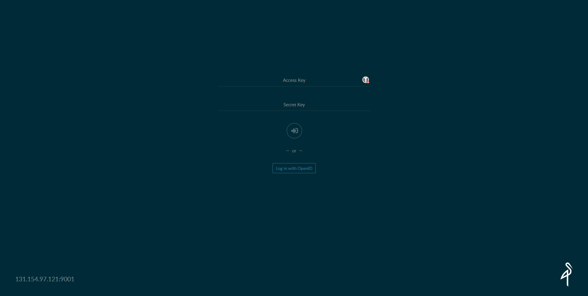
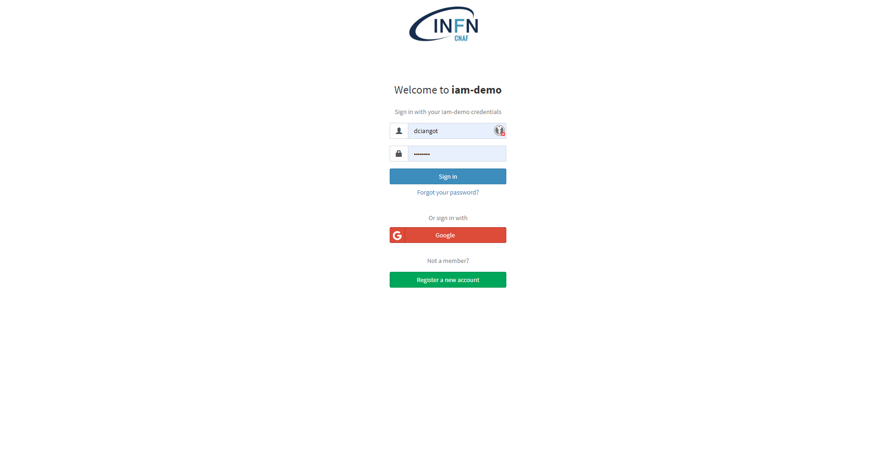
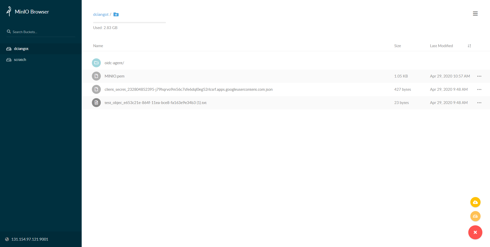
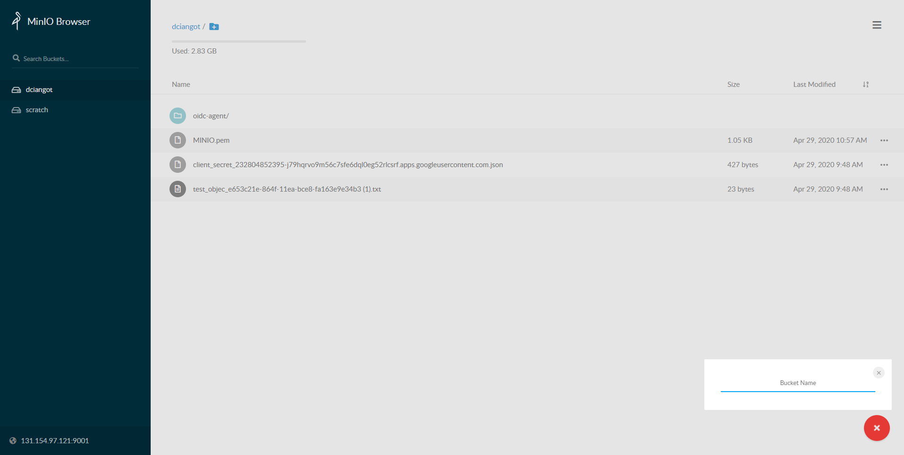

# Usare WebUI

Per questo quick-start usiamo un deployment gia' pronto installato come descritto [qui]("Encryption.md")

## Requirement

- Registrare un account in [IAM-demo](https://iam-demo.cloud.cnaf.infn.it/)

## Login with IAM-demo

- Click on `Login with OpenID`

- Insert the credentials that you get on the requirement step above

- Now you should be allowed to login and see something like

You probably don't have any folder or bucket ready. So let's create a new bucket now.

## Create a bucket with your IAM username

- From the bottom right corner select `Create bucket` and user your IAM login name. As you are allowed by [OPA setup](README.md) to create only a bucket with you IAM username.

- Then select the bucket on the left bar.
- We are now ready to upload a file.

## Upload a file

- From the bottom right corner select `Upload`
- Chose a file from your filesystem and click ok
- The file should be now visible on the WebUI